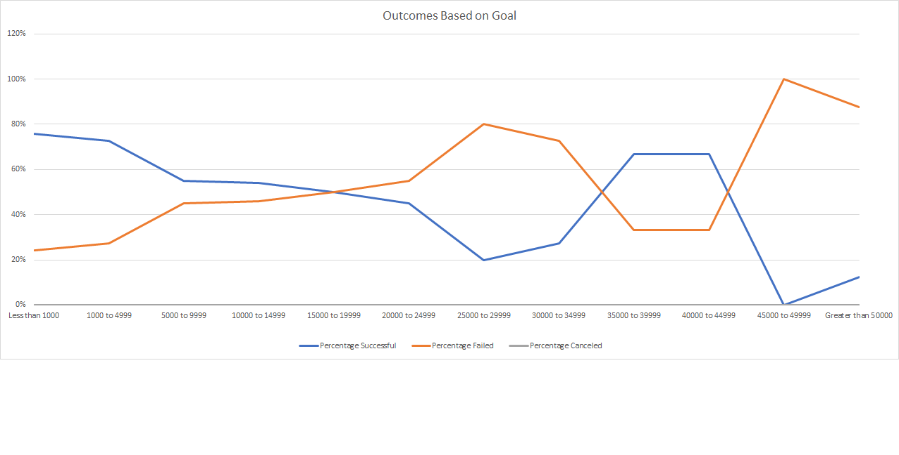

# Kickstarting with Excel

##    Overview of Project
	To find out how different campaign faired in comparison to launch date & funding goals.
### Purpose
	Help figure Louise if her campaign will be a success with the given data/facts
## Analysis and Challenges

### Analysis of Outcomes Based on Launch Date
	Used the pivot table to create the line chart with the month & the outcome using the theater as the filter for the parent category

### Analysis of Outcomes Based on Goals
	To figure out the outcome of the campaign depending upon campaign goal amount 

### Challenges and Difficulties Encountered
	Was not familiar with countif function. Didn't understand how the parameters had to be passed.
	Missed reading the filter by sub catogory and was wondering why graphs didn't match.
### Results
 	Two conclusion that could be drawn from the Launch date with respect to campaign goal is:
		The campaign was successful when launched in May
		The number of cancellation was more or less the throughout the year
	
###
	Outcomes based on Goals Conclusion 
		The sucees rate was higher for lower campaign goals 
		INSERT THE CHART HERE ?????

###
	The limitations of this dataset
		The dataset doesn't have the benefits the backer would get depending on their pledge

###
	What are some other possible tables and/or graphs that we could create?
		Theater outcome by the backer
		Theater outcome by country
